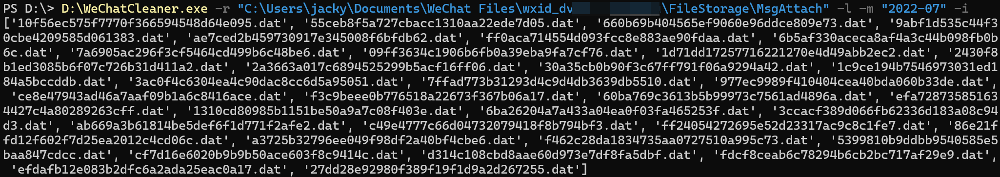

# WeChatCleaner

PC微信的新管理缓存方式变恶心了，这个小工具能按照月份和文件类型进行整理，包括查看，复制，和删除。



# 用法

打开一个命令行窗口: 
- Win+R, 输入cmd, 回车
- 在某个文件夹右键，在命令行/命令提示符打开

输入以下命令执行：
```
WeChatCleaner.exe [-r <到MsgAttach目录>] [-l/-c <复制目标目录>/-d] [-m <月份>] (-i/-f/-t/-v/-a)
```

其中最开始的WeChatCleaner.exe建议直接将它拖进命令行窗口（否则会提示找不到命令）。

几个用中括号括起来的东西必须输入，尖括号内的东西应该替换成你机器上的东西 并且加引号，圆括号内的输入可选。

-r后面跟到MsgAttach目录

[-l,-c,-d]三选一，分别表示查看，复制，删除。其中选择复制的时候需要跟着输入复制到的目录。

-m后面跟你选择的月份，格式为“年年年年-月月”，如"2022-07"。

-i,-f,-t,-v,-a用来选择对哪些类型的文件整理，分别表示图像，文件，表情，视频，和所有类型的缓存。

## 例子

我的用户名是jacky，并且把WeChatCleaner.exe放在了D盘根目录。

我想将2022年6月的视频全部复制到D盘的06文件夹：
```
D:\WeChatCleaner.exe -r "C:\Users\jacky\Documents\WeChat Files\wxid_xxxxxxxxx\FileStorage\MsgAttach" -c "D:\06" -m "2022-06" -v
```
其中wxid_xxxxxxxxx要替换成你的微信id。

我想查看2022年5月有哪些文件：
```
D:\WeChatCleaner.exe -r "C:\Users\jacky\Documents\WeChat Files\wxid_xxxxxxxxx\FileStorage\MsgAttach" -l -m "2022-05" -f
```

我想删除2022年7月的全部缓存：
```
D:\WeChatCleaner.exe -r "C:\Users\jacky\Documents\WeChat Files\wxid_xxxxxxxxx\FileStorage\MsgAttach" -d -m "2022-07" -a
```
